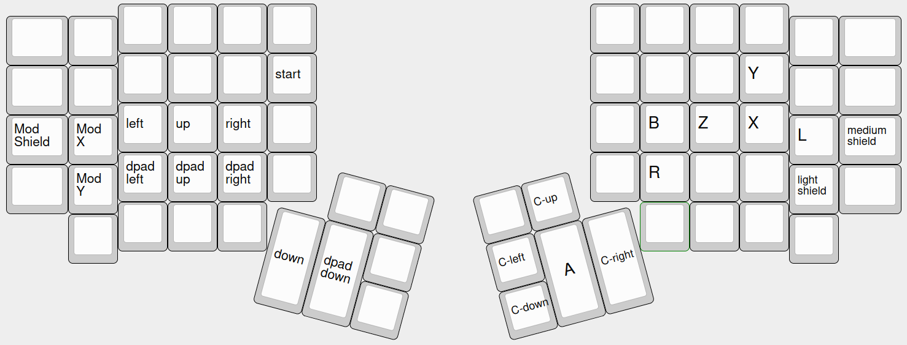

# LXZBRA

Emulates gamepad inputs for the purpose of playing Super Mash Bros Melee on Linux with a keyboard.

The layout is legal according to the controller addendum used at most tournaments that allow
box-style controllers.

The layout is named after the right-hand buttons from pinky inwards. The layout is inspired by
B0XX, with a few modifications:

- The analog stick is not split across the two hands. This makes the layout a bit more intuitive and
  easier to pick up, with no real downside.
- Modifiers for the analog stick have been moved to the left pinky instead. This enables more
  modifiers (up to 4 can be comfortably used, currently only 3 are defined), and also adheres to the
  philosophy of having the fingers rolling from pinky to thumb, since it's often the case that one
  wants to ensure that a modifier is activated before inputting the directional buttons.
- Jump and grab on the right hand have been swapped, because L-cancelled aerials and jump-cancel grab
  both flow from jump to grab. Though the ring finger is the weakest finger, short hopping doesn't
  seem to be problematic (in fact short hopping with characters with 3-frame jumpsquats seem
  completely inconsistent on mechanical key switches with 4mm of travel anyway so it's more limited
  by hardware than anything else).
- Y is not intended to be used, the B0XX's philosophy of "not crossing rows" is not applicable on a
  keyboard where the layout of keys are compact. Pressing X and then R to wavedash will not really
  pose any problems.

The analog stick co-ordinates are as follows:

|Modifier|X|Y|Diagonal|
|---|---|---|---|
|X|0.7375|0.6500|(0.7375, 0.3125)/23&deg;|
|X+C-right|||(0.8250, 0.5625)/34.3&deg;|
|Shield|0.6750|0.6500|(0.6750, 0.6500)/43.9&deg;|
|Null|1.0000|1.0000|(0.7000, 0.7000)/45&deg;|
|Y+C-right|||(0.5625, 0.8250)/55.7&deg;|
|Y|0.2875|0.6500|(0.3000, 0.7000)/66.8&deg;|

MX is used to input tilt-attacks (including angling ftilt up or down) and shallow wavedash/upB
angles. MY is used for steep angles, tilting the shield horizontally for shield dropping, and
turnaround neutral-B. Mod-Shield is used to tilt the shield maximally in each axis.

C-stick right modifies diagonals already modified with MX or MY by bringing them halfway towards the
diagonal. It is intended for finer-grained upB angles.

## Illegal Features

The `jump_delay_ms` argument is used to add a delay between when the corresponding key is pressed
and when the X button is input. This makes short hop timings much more lenient (which are
unnecessarily difficult on mechanical keyboards compared to controller and makes characters with a
3-frame jumpsquat almost completely unviable) at the cost of a fixed amount of input lag. This
feature is illegal according to the controller addendum because it is a macro which induces input on
a future frame than when the physical button is actuated.

## Known Bugs

- [ ] It seems impossible to have the analog stick co-ordinates perfect due to the way dolphin maps
  a uinput device's inputs to a gamecube controller's raw input values.
